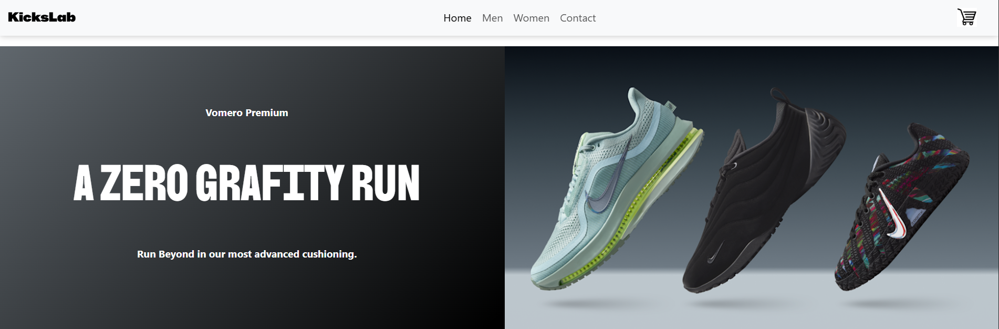
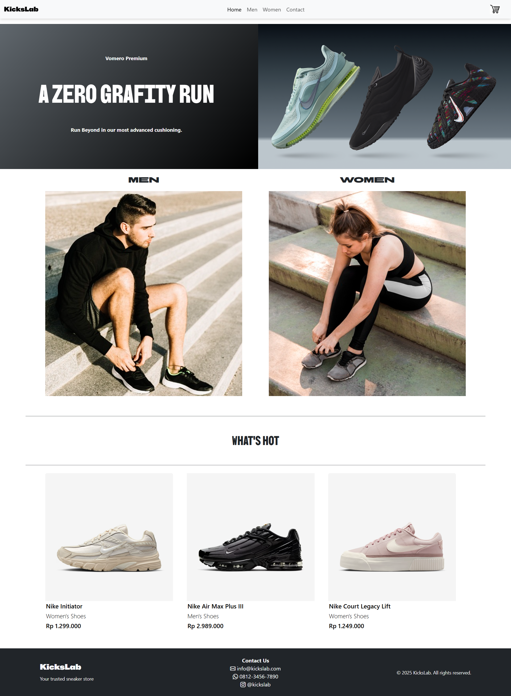
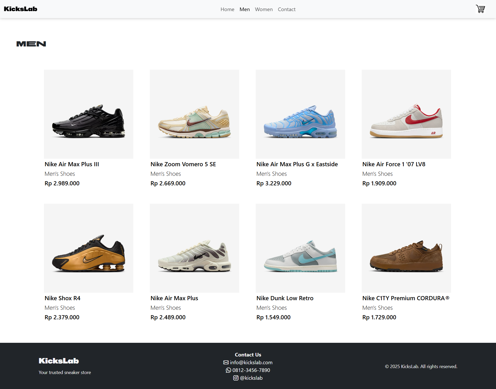
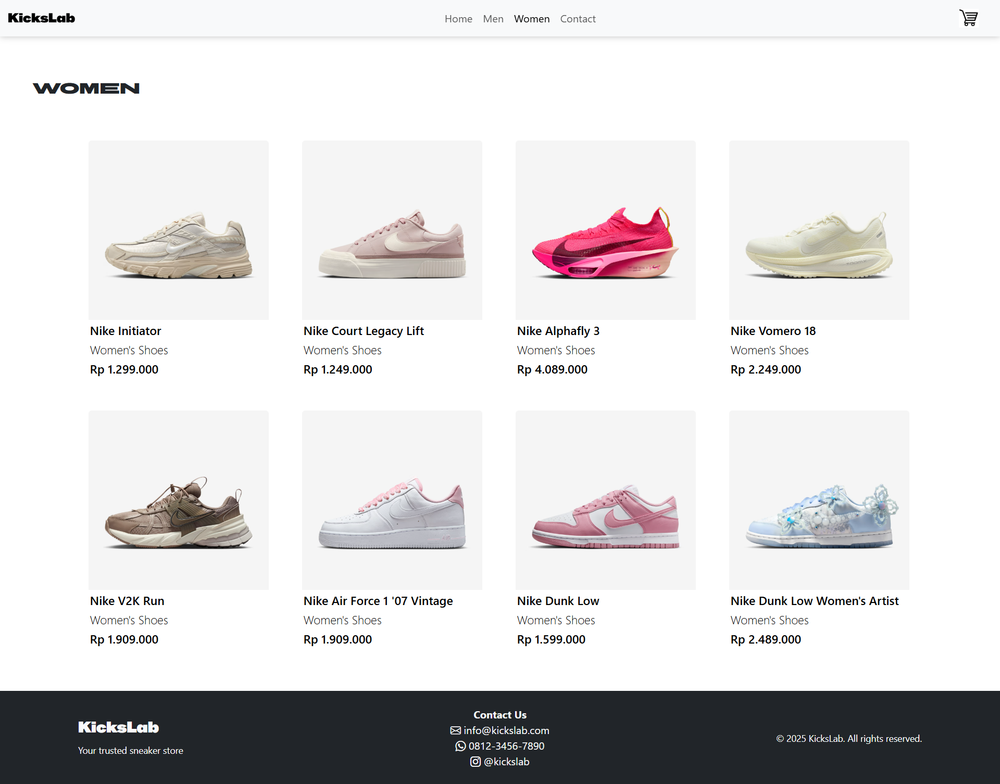
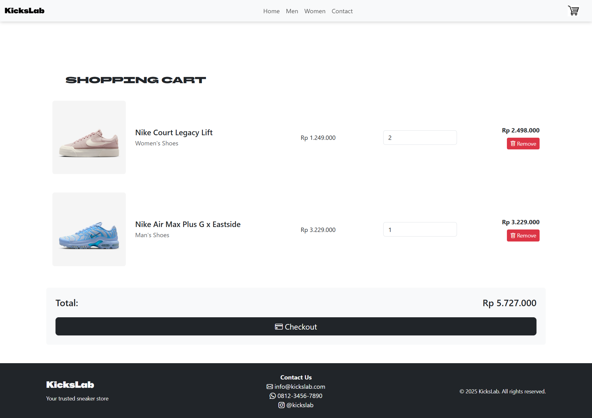

<!-- Banner -->
<p align="center">
  
</p>

<h1 align="center">👟 KicksLab</h1>
<p align="center">
  <i>A modern e-commerce website for sneaker enthusiasts featuring dynamic product catalog, smart shopping cart with localStorage persistence, and responsive design.</i>
</p>

<p align="center">
  <a href="https://zenoxyn.github.io/KicksLab-ecommerce-website"></a>
  <a href="https://github.com/zenoxyn/KicksLab-ecommerce-website"></a>
  <a href="LICENSE"></a>
</p>

---

## 🎥Youtube Link

<p align="center">
  <a href="https://youtu.be/3IWcXPO6NWk?si=RVLBkXK0Ic-nsKLr">KicksLab Website</a>
</p>

---

## 🚀 Live Preview

<p align="center">
   
</p>

<p align="center">
   
</p>

<p align="center">
   
</p>

<p align="center">
   
</p>

---

## ✨ Features

- 👟 **Dynamic Product System** — Products loaded dynamically via JavaScript from a centralized data source
- 🛒 **Smart Shopping Cart** — Add to cart, update quantity, remove items with persistent localStorage
- 🤖 **Single Product Detail Page** — One HTML file handles all product details using URL parameters
- 📱 **Responsive Design** — Optimized for desktop, tablet, and mobile devices
- 🎨 **Modern UI** — Clean design with Bootstrap 5 and custom CSS
- 💳 **Checkout System** — Simple checkout flow with order summary
- 🔍 **Product Categories** — Browse by Men's and Women's collections
- ⚡ **Fast & Lightweight** — Client-side rendering for quick page loads

---

## 🛠️ Tech Stack

| Technology           | Purpose                                                      |
| -------------------- | ------------------------------------------------------------ |
| **HTML5**            | Structure & semantic markup                                  |
| **CSS3**             | Styling, animations & responsive design                      |
| **JavaScript (ES6)** | Dynamic product rendering, cart functionality & localStorage |
| **Bootstrap 5**      | UI components & grid system                                  |
| **Bootstrap Icons**  | Icon library for UI elements                                 |
| **LocalStorage API** | Persistent cart data across sessions                         |

---

## 📦 Installation

```bash
# Clone this repository
git clone https://github.com/zenoxyn/KicksLab-ecommerce-website.git

# Navigate into the project
cd KicksLab

# Open in browser
start index.html   # Windows
open index.html    # Mac
# Or use Live Server extension in VS Code
```

---

## 📁 Project Structure

```
KicksLab/
│
├── index.html          # Homepage with featured products
├── men.html            # Men's collection page
├── women.html          # Women's collection page
├── product.html        # Dynamic product detail page
├── cart.html           # Shopping cart page
├── style.css           # Custom styles
├── script.js           # Product data & cart functions
├── img/                # Image assets
└── README.md           # Project documentation
```

---

## 🎯 How It Works

### Dynamic Product System

All product data is stored in `script.js` as an array of objects:

```javascript
window.products = [
  {
    id: 1,
    name: "Nike Initiator",
    type: "Women's Shoes",
    price: 1299000,
    img: "...",
    desc: "...",
  },
  // ... more products
];
```

### Product Detail Page

- Single `product.html` file handles all products
- Uses URL parameters: `product.html?id=1`
- JavaScript reads the `id` and displays corresponding product data

### Shopping Cart

- **Add to Cart**: Saves product ID and quantity to localStorage
- **View Cart**: Retrieves data from localStorage and displays products
- **Update Quantity**: Modify item quantities in real-time
- **Remove Items**: Delete products from cart
- **Persistent**: Cart data survives page refreshes

---

## 🚀 Features in Detail

### 1. **Homepage**

- Hero banner with featured product
- Category navigation (Men/Women)
- "What's Hot" section with trending products

### 2. **Product Categories**

- Men's and Women's dedicated pages
- Grid layout with product cards
- Direct links to product details

### 3. **Product Detail Page**

- Large product image
- Product name, type, and price
- Detailed description
- "Add to Cart" button

### 4. **Shopping Cart**

- List of added products with images
- Quantity adjustment controls
- Individual item removal
- Total price calculation
- Checkout button
- Empty cart state with "Continue Shopping" CTA

---

## 🎨 Design Highlights

- **Custom Fonts**: BBH Sans family for branding consistency
- **Color Scheme**: Dark navbar with gradient hero banner
- **Responsive Grid**: Bootstrap's grid system for flexible layouts
- **Smooth Interactions**: Hover effects and transitions

---

## 📱 Responsive Breakpoints

- **Mobile**: < 768px (2 columns)
- **Tablet**: 768px - 991px (3 columns)
- **Desktop**: ≥ 992px (4 columns)

---

## 🔧 Future Improvements

- [ ] Search functionality
- [ ] Product filtering by price/category
- [ ] User authentication
- [ ] Payment gateway integration
- [ ] Product reviews and ratings
- [ ] Wishlist feature
- [ ] Order history tracking

---

## 📄 License

This project is licensed under the MIT License.

---

## 👨‍💻 Author

Made with ❤️ for sneaker lovers everywhere.

---

## 🤝 Contributing

Contributions, issues, and feature requests are welcome!

---

<p align="center">
  <i>Happy Shopping! 👟✨</i>
</p>
